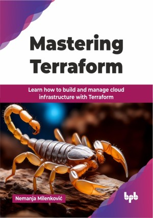

# Mastering Terraform

Learn how to build and manage cloud infrastructure with Terraform.

This is the repository for [Mastering Terraform
](https://bpbonline.com/products/mastering-terraform?variant=44317433069768),published by BPB Publications.

## About the Book
This book is a practical guide to mastering Terraform and IaC, helping readers build, manage, and scale modern infrastructure.

It introduces setting up Terraform environments, mastering HashiCorp Configuration Language (HCL), and managing infrastructure state effectively. Learn to use Terraform providers for cloud platforms, define resources, and use variables and outputs for dynamic setups. Advanced topics include reusable modules, CI/CD integration, performance tuning, and security best practices. It also explores Terraform Cloud and Enterprise, covering remote state, VCS integration, team management, and Sentinel policies for enterprise-level control, making it a complete resource for mastering Terraform and IaC.

By the end of this book, you will be well-equipped to manage your cloud infrastructure with confidence.  You will gain expertise in configuration management, security best practices, and even explore features of Terraform Cloud and Enterprise for enhanced collaboration and team management.

## What You Will Learn
• Set up Terraform and create reusable infrastructure configurations.

• Manage cloud environments with advanced orchestration techniques.

• Securely handle sensitive data and optimize infrastructure performance.

• Test and validate configurations for reliability and compliance.

• Anticipate trends like AI integration and multi-cloud strategies.
